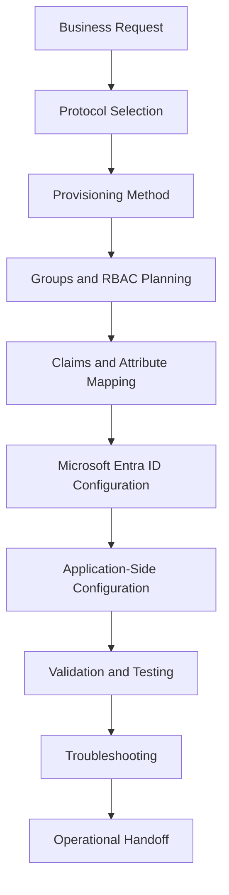

# IAM-003 - Enterprise Application Onboarding & SSO

> OmniVerse Enterprise Engineering Portfolio

## Overview

This repository documents enterprise application onboarding into Microsoft Entra ID using SAML 2.0, OpenID Connect, OAuth 2.0, and SCIM 2.0 provisioning.

Each application package follows a consistent engineering format covering the business request, architecture, implementation, validation, and troubleshooting — the same structure an IAM team would produce for a real enterprise onboarding engagement.

---

## Enterprise Application Onboarding Catalog

| # | Application | Protocol | Guide |
|---|---|---|---|
| APP-1001 | Grafana | SAML 2.0 | [Setup Guide](apps/Grafana/README.md) |
| APP-1002 | WordPress | OpenID Connect | [Setup Guide](apps/WordPress/README.md) |
| APP-1003 | GitHub Enterprise Cloud | SAML 2.0 | [Setup Guide](apps/GitHub-Enterprise/README.md) |
| APP-1004 | Salesforce | SAML 2.0 | [Setup Guide](apps/Salesforce/README.md) |
| APP-1005 | Atlassian Jira Cloud | SAML 2.0 | [Setup Guide](apps/Jira/README.md) |
| APP-1006 | Cisco Duo | OAuth 2.0 / Admin Consent | [Setup Guide](apps/Cisco-Duo/README.md) |
| APP-1007 | Keycloak | SAML 2.0 Federation | [Setup Guide](apps/Keycloak/README.md) |
| APP-1008 | SCIM Provisioning | SCIM 2.0 | [Setup Guide](apps/SCIM-Provisioning/README.md) |

---

## Standard Onboarding Workflow

---

## Skills Demonstrated

- Enterprise Application Onboarding
- Microsoft Entra ID Enterprise Applications
- Microsoft Entra ID App Registrations
- SAML 2.0 Federation
- OpenID Connect
- OAuth 2.0
- SCIM 2.0 Automated Provisioning
- Admin Consent Workflows
- Identity Provider Brokering
- Keycloak Administration
- JIT Provisioning
- Claims and Attribute Mapping
- X.509 Certificate Handling
- Metadata Exchange
- SSO Validation and Troubleshooting
- Operational Handoff Documentation

---

## Business Outcome

This repository demonstrates how an IAM engineer evaluates, configures, validates, troubleshoots, and documents application integrations with Microsoft Entra ID across multiple enterprise platforms.

Created by **Keshawn Lynch**
