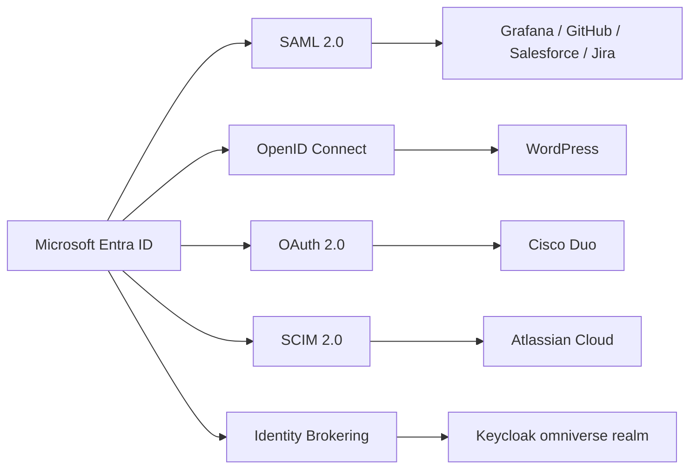
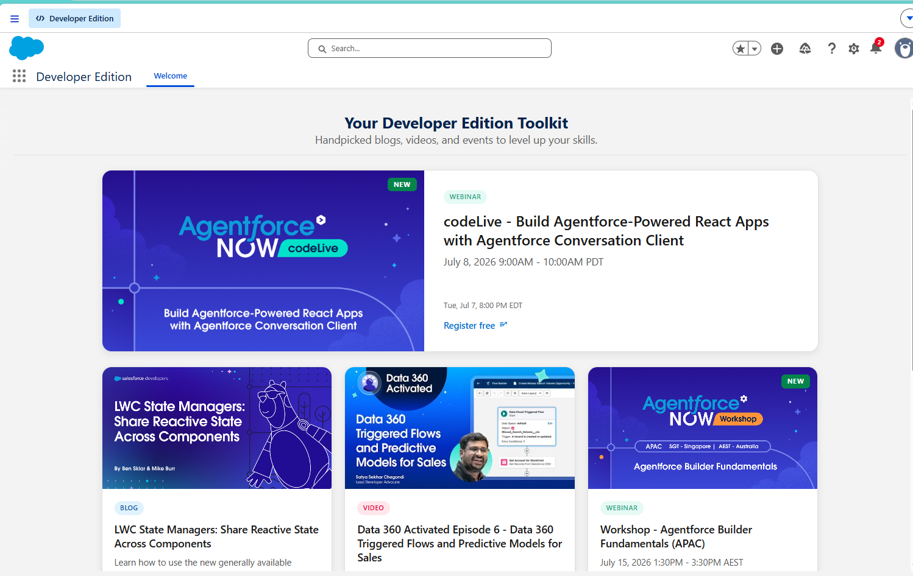
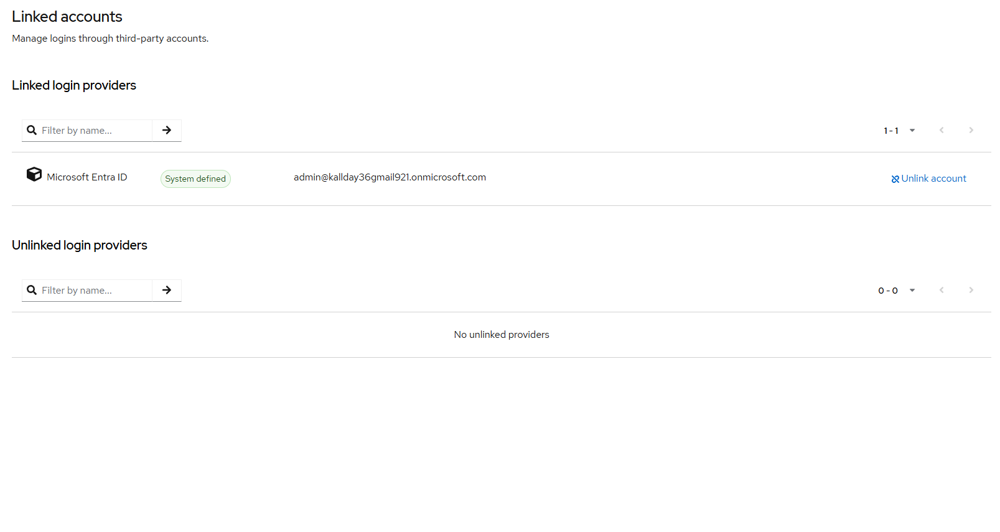

# IAM-002 - Enterprise Application Onboarding and SSO

> OmniVerse Enterprise Engineering Portfolio

[Back to Portfolio](https://github.com/KSWISHA9)


Enterprise application onboarding using Microsoft Entra ID across SAML 2.0, OpenID Connect, OAuth 2.0, SCIM provisioning, and Keycloak SAML identity federation.

---

## Table of Contents

- Business Request
- Architecture
- Application Catalog
- Walkthrough
- Skills Demonstrated
- Technologies
- Repository Structure
- Lessons Learned
- Future Enhancements
- Related Projects

---

## Business Request

OmniVerse required centralized Single Sign-On for eight enterprise platforms spanning infrastructure monitoring, CRM, project management, developer tooling, and internal identity platforms.

The IAM team was tasked with evaluating authentication protocols, configuring enterprise applications in Microsoft Entra ID, validating SSO end to end, and documenting a repeatable onboarding workflow.

---

## Architecture



---

## Application Catalog

| Application | Protocol | Guide |
|---|---|---|
| Grafana | SAML 2.0 | [Setup Guide](apps/Grafana/README.md) |
| WordPress | OpenID Connect | [Setup Guide](apps/WordPress/README.md) |
| GitHub Enterprise Cloud | SAML 2.0 | [Setup Guide](apps/GitHub-Enterprise/README.md) |
| Salesforce | SAML 2.0 | [Setup Guide](apps/Salesforce/README.md) |
| Atlassian Jira Cloud | SAML 2.0 | [Setup Guide](apps/Jira/README.md) |
| Cisco Duo | OAuth 2.0 / Admin Consent | [Setup Guide](apps/Cisco-Duo/README.md) |
| Keycloak | SAML 2.0 Federation | [Setup Guide](apps/Keycloak/README.md) |
| SCIM Provisioning | SCIM 2.0 | [Setup Guide](apps/SCIM-Provisioning/README.md) |

---

## Walkthrough


SAML 2.0 onboarding for Grafana - Entity ID, Reply URL, and signing certificate configured in Microsoft Entra ID with IdP metadata exchanged into Grafana successfully.

---


OpenID Connect onboarding for WordPress - JWT identity token validated after configuring the miniOrange OIDC plugin with Entra ID App Registration credentials.

---


GitHub Enterprise Cloud SAML validation - Entra ID authenticated the user and GitHub Enterprise accepted the SAML assertion completing enterprise SSO.

---



Salesforce SAML SSO completed - IdP-initiated flow from Microsoft Entra ID authenticated directly into the Salesforce dashboard without local credentials.

---



Keycloak Identity Provider Brokering - Microsoft Entra ID federated as an upstream SAML IdP with the linked account confirmed in the Keycloak account console after JIT provisioning.

---


SCIM 2.0 automated provisioning from Microsoft Entra ID to Atlassian Cloud - attribute mapping including the required emails type eq work value format validated and confirmed.

---

## Skills Demonstrated

- Enterprise Application Onboarding
- SAML 2.0 Federation
- OpenID Connect
- OAuth 2.0 and Admin Consent
- SCIM 2.0 Automated Provisioning
- Identity Provider Brokering
- Keycloak Administration
- Just-in-Time Provisioning
- Claims and Attribute Mapping
- X.509 Certificate Handling
- Metadata Exchange
- SSO Validation and Troubleshooting

---

## Technologies

| Technology | Purpose |
|---|---|
| Microsoft Entra ID | Identity provider |
| Keycloak 26.6.4 via Docker | Identity broker |
| Grafana | SAML SP |
| WordPress / miniOrange | OIDC SP |
| GitHub Enterprise Cloud | SAML SP |
| Salesforce Developer Edition | SAML SP |
| Atlassian Jira Cloud | SAML SP and SCIM target |
| Cisco Duo | OAuth admin consent |

---

## Repository Structure

```text
IAM-002-Enterprise-Application-Onboarding-SSO/
ss apps/
ss     Grafana/
ss     WordPress/
ss     GitHub-Enterprise/
ss     Salesforce/
ss     Jira/
ss     Cisco-Duo/
ss     Keycloak/
ss     SCIM-Provisioning/
ss screenshots/
ss README.md
```

---

## Lessons Learned

- Keycloak requires Identity Provider Brokering when receiving assertions from an upstream IdP - a direct SAML client will not work.
- SCIM provisioning requires exact schema-compliant attribute mapping - Atlassian Cloud expects a specific email format.
- Provision on Demand is essential validation before enabling full automatic SCIM sync.
- Most SSO failures trace back to mismatched Entity IDs or Reply URLs - validate metadata exchange first.

---

## Future Enhancements

- Group-based RBAC mapping for all applications
- Conditional Access integration per application sensitivity
- Lifecycle Workflows for automated provisioning
---

## Related Projects

| Project | Description |
|---|---|
| [INFRA-001 Enterprise Active Directory](https://github.com/KSWISHA9/INFRA-001-Enterprise-Active-Directory-Infrastructure) | DNS, DHCP, OUs, GPOs, 2,000 users |
| [IAM-001 Hybrid Identity Engineering](https://github.com/KSWISHA9/IAM-001-Hybrid-Identity-Engineering) | Entra Connect, sync, hard/soft match |
| [IAM-002 Enterprise Application Onboarding](https://github.com/KSWISHA9/IAM-002-Enterprise-Application-Onboarding-SSO) | SAML, OIDC, OAuth, SCIM, Keycloak |
| [IAM-003 Identity Lifecycle Automation](https://github.com/KSWISHA9/IAM-003-Identity-Lifecycle-Automation) | Joiner-Mover-Leaver, Graph, RBAC |
| [IAM-004 Conditional Access and Zero Trust](https://github.com/KSWISHA9/IAM-004-Conditional-Access-Zero-Trust) | MFA, CA policies, named locations |
| [IAM-005 Identity Governance](https://github.com/KSWISHA9/IAM-005-Identity-Governance) | PIM, Access Reviews, Entitlement Management |
| [IAM-006 Identity Operations and Risk Analytics](https://github.com/KSWISHA9/IAM-006-Enterprise-Identity-Operations-Risk-Analytics) | Risk scoring, dashboards, remediation |
| [IAM-007 Enterprise Hybrid Identity Migration](https://github.com/KSWISHA9/IAM-007-Enterprise-Hybrid-Identity-Migration) | Hybrid identity migration case study, 61 users |

---

Created by **Keshawn Lynch**
