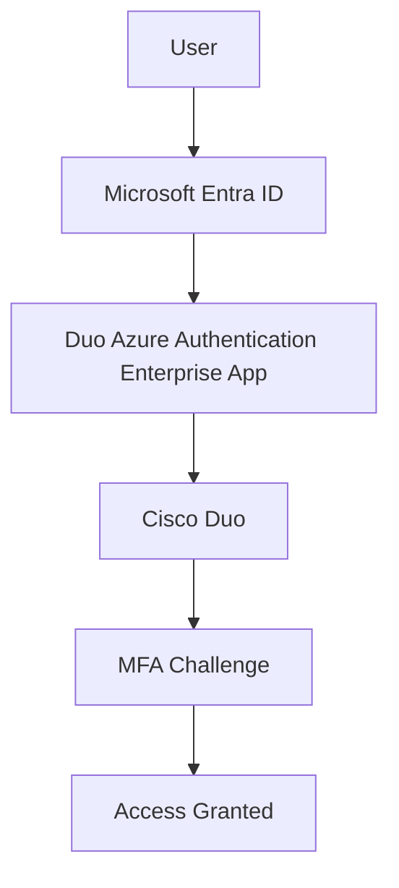

## Enterprise Application Packages

- [Repository Home](../../README.md)
- [Grafana SAML Onboarding](../Grafana/README.md)
- [WordPress OIDC Onboarding](../WordPress/README.md)
- [GitHub Enterprise SAML Onboarding](../GitHub-Enterprise/README.md)
- [Salesforce SAML Onboarding](../Salesforce/README.md)
- [Atlassian Jira SAML Onboarding](../Jira/README.md)
- [Keycloak SAML Federation](../Keycloak/README.md)
- [SCIM Provisioning](../SCIM-Provisioning/README.md)

---

# APP-1006 - Cisco Duo Identity Integration with Microsoft Entra ID

## Business Request

The security team requested Cisco Duo integration with Microsoft Entra ID to strengthen multi-factor authentication, improve identity protection, and prepare for Zero Trust access controls.

---

## Implementation Summary

| Area | Configuration |
|---|---|
| Application | Cisco Duo |
| Microsoft Integration | Duo Azure Authentication |
| Identity Platform | Microsoft Entra ID |
| Integration Type | OAuth 2.0 Authorization / Admin Consent |
| Security Capability | MFA / Conditional Access / Universal Prompt |
| Provisioning | Not configured in this phase |
| Status | Successfully Configured |

---

## Architecture

---

## Configuration Steps

1. Opened Cisco Duo Single Sign-On configuration.
2. Reviewed available Duo SSO applications.
3. Selected Microsoft Azure Active Directory integration.
4. Started Azure authorization from Cisco Duo.
5. Granted Microsoft Entra administrator consent.
6. Verified Duo Azure Authentication Enterprise Application in Entra.
7. Confirmed audit logs showing service principal creation, delegated permissions, and consent activity.

---

## Validation

- Duo Azure Authentication Enterprise Application was created in Entra.
- Application ID matched the Duo custom control configuration.
- Admin consent was granted successfully.
- Delegated permissions were added.
- Service principal creation was logged in Entra audit logs.
- Application role assignment activity was recorded.

---

## Screenshots

### 1. Cisco Duo SSO Dashboard
Shows the Cisco Duo Single Sign-On dashboard where Azure AD integration was initiated.

### 2. Duo SSO Application Catalog
Shows the available Duo SSO applications including Microsoft Azure Active Directory.

### 3. Azure Authorization Step
Shows the Azure authorization request initiated from Cisco Duo.

### 4. Microsoft Entra Admin Consent
Shows the Microsoft Entra administrator consent screen.

### 5. Duo Azure Application Configuration
Shows the Duo Azure application configuration confirming the integration settings.

### 6. Duo Enterprise Application in Entra
Shows the Duo Azure Authentication Enterprise Application created in Microsoft Entra ID after admin consent.

### 7. Entra Audit Logs
Shows Entra audit logs confirming service principal creation, delegated permissions, and consent activity.

---

## Troubleshooting

### Admin Consent Review Required
Administrator consent must be reviewed before approval. Permissions granted to Duo should be audited to confirm they align with organizational security policy.

---

## Lessons Learned

Cisco Duo uses a different onboarding pattern than traditional SAML applications. The integration begins in Duo, requests Microsoft Entra authorization, and automatically creates the Enterprise Application after admin consent. Not all enterprise integrations follow the same SAML setup pattern.

---

## Future Enhancements

- Configure Duo with Microsoft Entra Conditional Access
- Test Universal Prompt authentication
- Add Duo policy enforcement scenarios
- Connect to IAM-004 Conditional Access and Zero Trust
