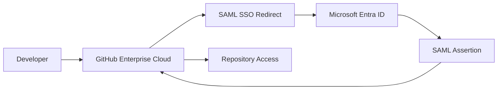

## Enterprise Application Packages

- [Repository Home](../../README.md)
- [Grafana SAML Onboarding](../Grafana/README.md)
- [WordPress OIDC Onboarding](../WordPress/README.md)
- [Salesforce SAML Onboarding](../Salesforce/README.md)
- [Atlassian Jira SAML Onboarding](../Jira/README.md)
- [Cisco Duo Identity Integration](../Cisco-Duo/README.md)
- [Keycloak SAML Federation](../Keycloak/README.md)
- [SCIM Provisioning](../SCIM-Provisioning/README.md)

---

# APP-1003 - GitHub Enterprise Cloud SAML Onboarding

## Business Request

The Development Engineering team requested Single Sign-On for GitHub Enterprise Cloud to centralize authentication, eliminate standalone GitHub credentials, and protect enterprise repositories through Microsoft Entra ID.

---

## Implementation Summary

| Area | Configuration |
|---|---|
| Application | GitHub Enterprise Cloud |
| Protocol | SAML 2.0 |
| Identity Provider | Microsoft Entra ID |
| Service Provider | GitHub Enterprise Cloud |
| Authentication Flow | Enterprise SAML SSO |
| Certificate | Microsoft Entra token signing certificate |
| Provisioning | Manual |
| Status | Successfully Configured |

---

## Architecture

---

## Configuration Steps

1. Created a GitHub Enterprise Cloud trial and OmniVerse organization.
2. Opened GitHub Enterprise authentication security settings.
3. Created the GitHub Enterprise Cloud Enterprise Application in Microsoft Entra ID.
4. Configured Basic SAML settings.
5. Downloaded the Microsoft Entra token signing certificate.
6. Entered Entra IdP values into GitHub Enterprise.
7. Tested SAML authentication.
8. Validated successful SAML identity authentication.

---

## Claims and Attribute Mapping

| Claim | Value |
|---|---|
| givenname | user.givenname |
| surname | user.surname |
| emailaddress | user.mail |
| name | user.userprincipalname |
| NameID | user.userprincipalname |

---

## Validation

- GitHub redirected authentication to Microsoft Entra ID.
- Microsoft Entra ID authenticated the user successfully.
- GitHub accepted the SAML assertion.
- GitHub displayed a successful SAML validation message.

---

## Screenshots

### 1. GitHub Enterprise Trial
Shows the GitHub Enterprise Cloud trial setup.

### 2. GitHub Organization Created
Shows the OmniVerse Enterprise GitHub organization.

### 3. Authentication Security Settings
Shows the GitHub Enterprise authentication security area.

### 4. Microsoft Entra Gallery Application
Shows GitHub Enterprise Cloud selected from the Microsoft Entra gallery.

### 5. GitHub SAML Configuration
Shows the GitHub SAML configuration page where Entra IdP values were entered.

### 6. Basic SAML Configuration
Shows the completed Basic SAML Configuration in Microsoft Entra ID.

### 7. SAML Authentication
Shows Microsoft Entra authentication during the GitHub SAML test.

### 8. Successful SAML Validation
Shows GitHub successfully validating the SAML identity.

---

## Troubleshooting

### Issue 1 - Wrong GitHub Enterprise Application Type
Multiple Entra gallery applications exist for GitHub. Selected the GitHub Enterprise Cloud Enterprise Account application specifically.

### Issue 2 - AADSTS650056 Misconfigured Application
First test returned a misconfigured application error due to a mismatch between the application template and the GitHub SAML request. Resolved by selecting the correct application and updating SAML values.

---

## Engineering Takeaways

This onboarding demonstrated enterprise-level SaaS federation, certificate trust, gallery application selection, SAML troubleshooting, and validation of a real GitHub Enterprise SAML integration.

---

## Future Enhancements

- SCIM provisioning and group synchronization
- Repository access reviews
- Conditional Access policy integration
