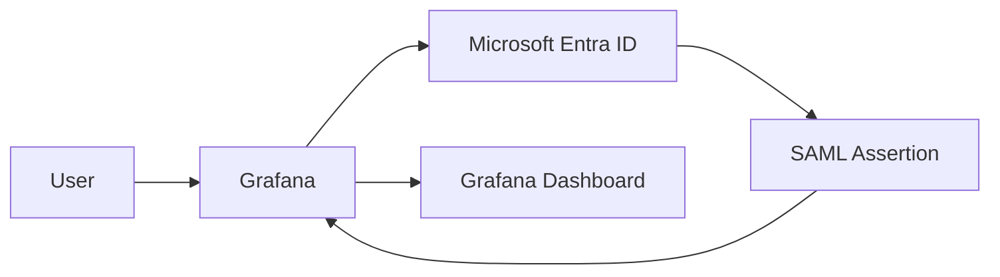

## Enterprise Application Packages

- [Repository Home](../../README.md)
- [WordPress OIDC Onboarding](../WordPress/README.md)
- [GitHub Enterprise SAML Onboarding](../GitHub-Enterprise/README.md)
- [Salesforce SAML Onboarding](../Salesforce/README.md)
- [Atlassian Jira SAML Onboarding](../Jira/README.md)
- [Cisco Duo Identity Integration](../Cisco-Duo/README.md)
- [Keycloak SAML Federation](../Keycloak/README.md)
- [SCIM Provisioning](../SCIM-Provisioning/README.md)

---

# APP-1001 - Grafana SAML Onboarding

## Business Request

The Infrastructure Operations team requested Single Sign-On for Grafana to centralize authentication, eliminate local accounts, and prepare the platform for group-based access control.

---

## Implementation Summary

| Area | Configuration |
|---|---|
| Application | Grafana |
| Protocol | SAML 2.0 |
| Identity Provider | Microsoft Entra ID |
| Service Provider | Grafana |
| Authentication Flow | SP-Initiated SAML |
| Certificate | Microsoft Entra token signing certificate |
| Provisioning | Manual |
| Status | Successfully Configured |

---

## Architecture

---

## Configuration Steps

1. Created the Grafana Enterprise Application in Microsoft Entra ID.
2. Selected SAML as the authentication protocol.
3. Configured Basic SAML settings including Entity ID and Reply URL.
4. Downloaded the Microsoft Entra SAML signing certificate.
5. Configured Grafana SAML settings with Entra IdP information.
6. Reviewed and confirmed default and advanced claims.
7. Added group claim support for future RBAC.
8. Validated SAML configuration readiness.

---

## Claims and Attribute Mapping

| Claim | Value |
|---|---|
| NameID | Primary user identifier |
| Email | User email mapping |
| Display Name | User profile display |
| Group Claim | Future RBAC mapping |

---

## Validation

- SAML application created in Microsoft Entra ID.
- Grafana SAML settings populated with Entra IdP values.
- Microsoft Entra metadata confirmed available.
- Group claim configuration added.
- SAML configuration reached ready state.

---

## Screenshots

### 1. Application Overview
Shows the Grafana Enterprise Application created in Microsoft Entra ID.

### 2. Blank SAML Configuration
Shows the initial SAML configuration state before values were added.

### 3. Basic SAML Configuration
Shows the Entity ID and Reply URL configured in Microsoft Entra ID.

### 4. Grafana SAML Settings
Shows the Grafana-side SAML configuration where IdP values were entered.

### 5. Attributes and Claims
Shows default claim mappings configured in Microsoft Entra ID.

### 6. Group Claim Added
Shows group claim configuration for future RBAC.

### 7. SAML Certificate Metadata
Shows the Microsoft Entra SAML certificate and metadata values.

### 8. SAML Configuration Ready
Shows the SAML configuration reaching a ready state.

---

## Troubleshooting

### Reply URL Mismatch
Verify the Reply URL in Entra matches the Grafana ACS URL exactly, including trailing slashes.

### Certificate Metadata Issues
Ensure the Entra SAML signing certificate is downloaded in Base64 format and correctly referenced in Grafana.

---

## Engineering Takeaways

This onboarding demonstrated SAML application onboarding, IdP/SP metadata exchange, certificate handling, claims review, and RBAC planning for an infrastructure monitoring platform.

---

## Future Enhancements

- Group-based RBAC mapping from Entra groups to Grafana roles
- Automated provisioning via SCIM
- Conditional Access policy integration
