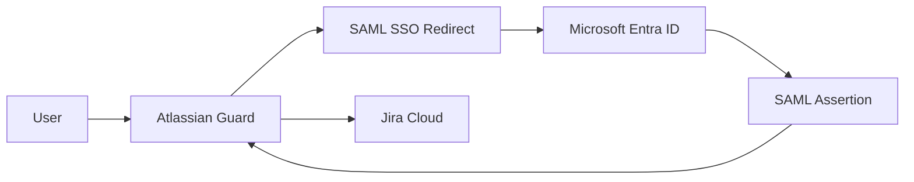
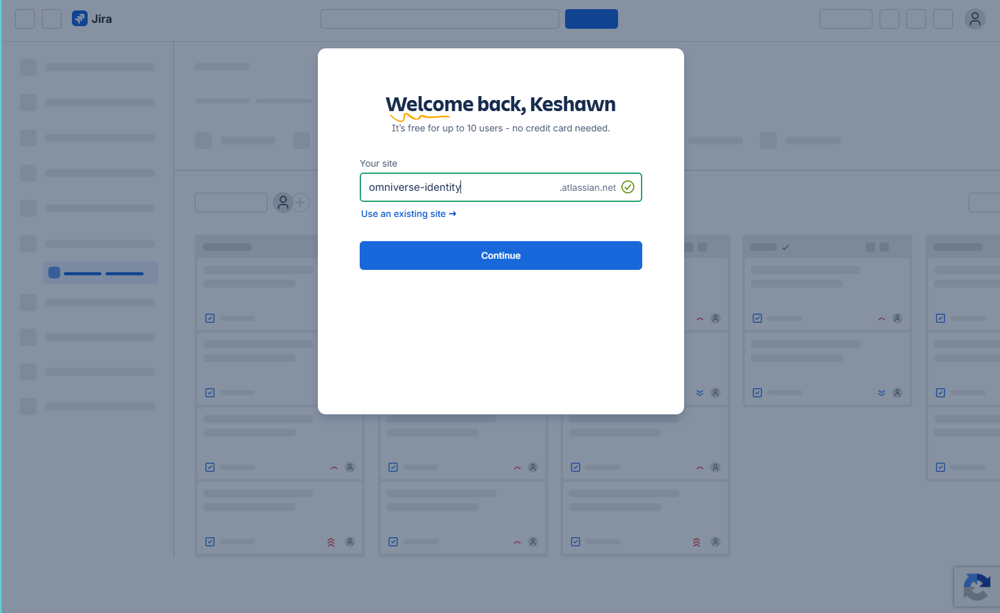
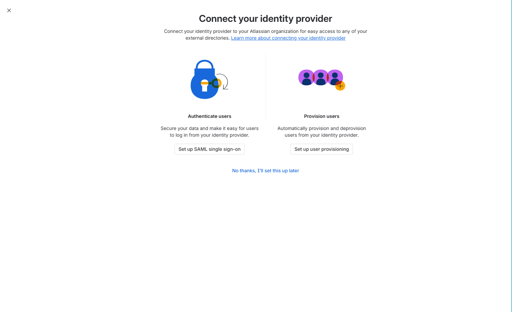
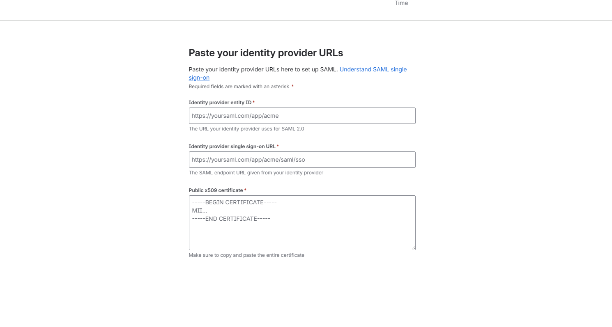
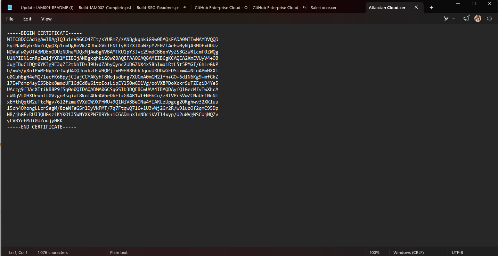

## Enterprise Application Packages

- [Repository Home](../../README.md)
- [Grafana SAML Onboarding](../Grafana/README.md)
- [WordPress OIDC Onboarding](../WordPress/README.md)
- [GitHub Enterprise SAML Onboarding](../GitHub-Enterprise/README.md)
- [Salesforce SAML Onboarding](../Salesforce/README.md)
- [Cisco Duo Identity Integration](../Cisco-Duo/README.md)
- [Keycloak SAML Federation](../Keycloak/README.md)
- [SCIM Provisioning](../SCIM-Provisioning/README.md)

---

# APP-1005 - Atlassian Jira Cloud SAML Onboarding

## Business Request

The Engineering and Project Management teams requested Single Sign-On for Jira Cloud to centralize authentication, reduce local credential dependency, and align Atlassian access with Microsoft Entra ID.

---

## Implementation Summary

| Area | Configuration |
|---|---|
| Application | Atlassian Jira Cloud |
| Platform | Atlassian Guard |
| Protocol | SAML 2.0 |
| Identity Provider | Microsoft Entra ID |
| Service Provider | Atlassian Cloud |
| Certificate | Microsoft Entra token signing certificate |
| Provisioning | Manual (SCIM configured separately in APP-1008) |
| Status | Successfully Configured |

---

## Architecture

---

## Configuration Steps

1. Created the Jira / Atlassian Cloud environment.
2. Started Atlassian Guard SAML setup workflow.
3. Created the Atlassian Cloud Enterprise Application in Microsoft Entra ID.
4. Copied Microsoft Entra IdP values into Atlassian.
5. Downloaded and imported the Microsoft Entra X.509 certificate.
6. Copied Atlassian SP Entity ID and ACS URL into Entra.
7. Saved the SAML configuration.
8. Tested SSO from Microsoft Entra ID.
9. Validated successful access to Atlassian Cloud.

---

## Claims and Attribute Mapping

| Claim | Value |
|---|---|
| NameID | user.userprincipalname |
| emailaddress | user.mail |
| givenname | user.givenname |
| surname | user.surname |

---

## SAML Configuration

| Setting | Value |
|---|---|
| Atlassian SP Entity ID | https://auth.atlassian.com/saml/fad29fad-5a7a-4627-b633-bdf6191faa2b |
| Atlassian ACS URL | https://auth.atlassian.com/login/callback?connection=saml-fad29fad-5a7a-4627-b633-bdf6191faa2b |
| Microsoft Entra Identifier | https://sts.windows.net/427c9654-7012-4c8c-be66-268eb6b12f32/ |

---

## Validation

- Atlassian accepted the Microsoft Entra IdP configuration.
- Entra accepted the Atlassian SP Entity ID and ACS URL.
- Atlassian completed SAML setup successfully.
- User successfully accessed Atlassian Cloud after SAML login.

---

## Screenshots

### 1. Jira Home
Shows the Atlassian / Jira Cloud environment.

### 2. Atlassian Cloud Gallery App
Shows the Atlassian Cloud application selected from the Entra gallery.

### 3. SAML Setup Start
Shows the Atlassian Guard SAML setup page.

### 4. Identity Provider Configuration
Shows the Atlassian page where Entra IdP values were entered.

### 5. Entra SAML Configuration
Shows the completed SAML configuration in Microsoft Entra ID.

### 6. Atlassian Service Provider URLs
Shows the Atlassian SP Entity ID and ACS URL.

### 7. SAML Configuration Complete
Confirms Atlassian completed the SAML setup.

### 8. SSO Test
Shows the SSO test workflow initiated from Microsoft Entra ID.

### 9. Successful Atlassian Login
Shows successful access to Atlassian Cloud after the SAML flow.

---

## Troubleshooting

### Issue 1 - Initial Login Retry Required
The first SAML login attempt displayed a temporary Atlassian login error. Retrying completed successfully. This was attributed to browser session state immediately after enabling SAML.

---

## Engineering Takeaways

This onboarding demonstrated Atlassian Guard SAML configuration, IdP/SP metadata exchange, X.509 certificate handling, ACS URL configuration, and real-world troubleshooting.

---

## Future Enhancements

- SCIM provisioning via APP-1008
- Atlassian authentication policy enforcement
- Group-based access and project permissions
