## Enterprise Application Packages

- [Repository Home](../../README.md)
- [Grafana SAML Onboarding](../Grafana/README.md)
- [WordPress OIDC Onboarding](../WordPress/README.md)
- [GitHub Enterprise SAML Onboarding](../GitHub-Enterprise/README.md)
- [Salesforce SAML Onboarding](../Salesforce/README.md)
- [Atlassian Jira SAML Onboarding](../Jira/README.md)
- [Cisco Duo Identity Integration](../Cisco-Duo/README.md)
- [SCIM Provisioning](../SCIM-Provisioning/README.md)

---


# APP-1007 - Keycloak SAML Federation with Microsoft Entra ID

## Business Request

The platform engineering team requested Microsoft Entra ID federation with the OmniVerse Keycloak identity platform to allow centralized authentication for internal applications managed through Keycloak, without requiring separate Keycloak credentials.

---

## Implementation Summary

| Area | Configuration |
|---|---|
| Application | Keycloak 26.6.4 |
| Deployment | Docker (quay.io/keycloak/keycloak:latest) |
| Realm | omniverse |
| Protocol | SAML 2.0 |
| Federation Pattern | Identity Provider Brokering |
| Keycloak Role | Identity Broker (SAML SP to Microsoft Entra ID) |
| Entra Role | Identity Provider (IdP) |
| Identity Provider Alias | microsoft-entra |
| Keycloak ACS URL | http://localhost:8080/realms/omniverse/broker/microsoft-entra/endpoint |
| NameID Format | email |
| Provisioning | Just-in-Time via first broker login flow |
| Status | Successfully Configured |

---

## Architecture

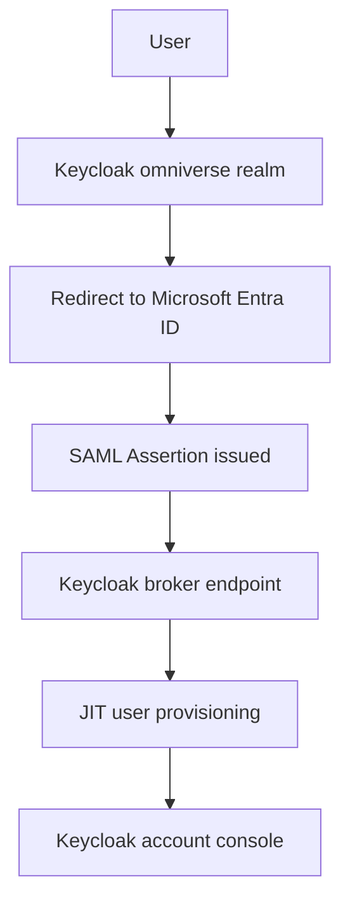

---

## Key Engineering Decision

Initial attempts configured Keycloak as a direct SAML SP using a custom client. This failed because Keycloak SAML clients are designed for Keycloak acting as an IdP, not for receiving upstream IdP assertions.

The correct pattern is **Identity Provider Brokering**, which provides a dedicated broker endpoint and handles the full SAML lifecycle automatically.

Broker endpoint format:
```text
http://<host>/realms/<realm>/broker/<idp-alias>/endpoint
```

---

## Configuration Steps

1. Deployed Keycloak 26.6.4 via Docker with environment variable admin credentials.
2. Created the omniverse realm via kcadm CLI.
3. Created the OmniVerse Keycloak Enterprise Application in Microsoft Entra ID.
4. Configured Basic SAML settings in Entra using the Keycloak broker endpoint.
5. Downloaded Entra Federation Metadata XML.
6. Created the microsoft-entra Identity Provider in Keycloak via kcadm CLI.
7. Created a test user in the omniverse realm.
8. Triggered SP-initiated SSO via the Keycloak broker login URL.
9. Completed first broker login profile confirmation.
10. Validated successful federated authentication into the Keycloak account console.

---

## SAML Configuration

| Setting | Value |
|---|---|
| Entra Identifier (Entity ID) | https://sts.windows.net/427c9654-7012-4c8c-be66-268eb6b12f32/ |
| Reply URL (ACS) | http://localhost:8080/realms/omniverse/broker/microsoft-entra/endpoint |
| Keycloak SSO URL | https://login.microsoftonline.com/427c9654-7012-4c8c-be66-268eb6b12f32/saml2 |
| NameID Format | email |

---

## Validation

- Microsoft Entra ID accepted the SAML authentication request from Keycloak.
- Entra ID issued a valid SAML assertion.
- Keycloak received and validated the assertion at the broker endpoint.
- First broker login flow executed successfully.
- User profile created in the omniverse realm via JIT provisioning.
- Linked accounts page confirmed Microsoft Entra ID as the linked login provider.

---

## Screenshots

### 1. Keycloak Admin Console
Shows the Keycloak 26.6.4 admin console after deployment.
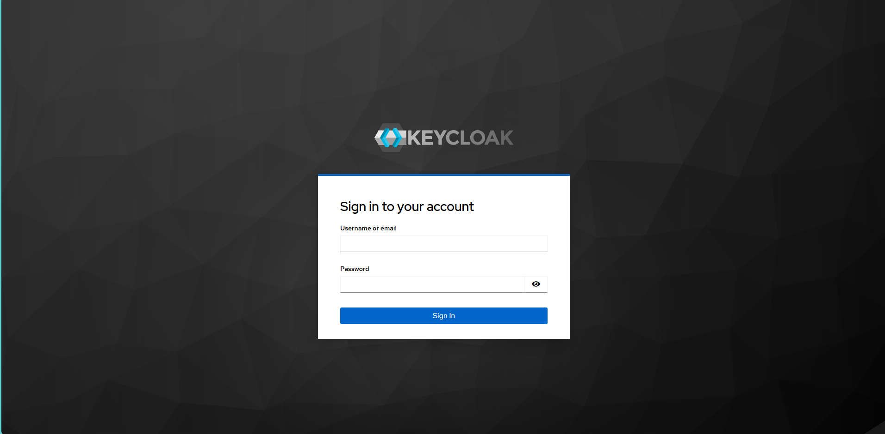

### 2. OmniVerse Realm Created
Shows the omniverse realm created in Keycloak.
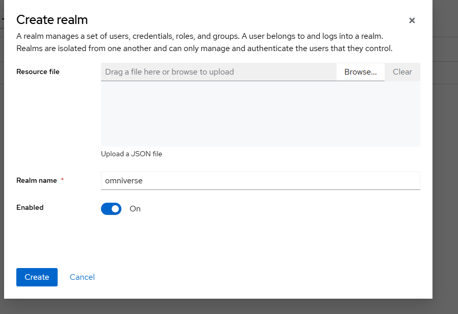

### 3. SAML Client Created
Shows the initial SAML client created during the first configuration attempt.
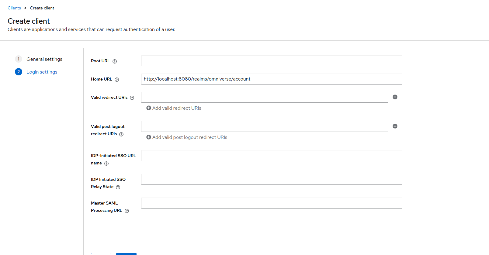

### 4. SAML Client Settings
Shows the SAML client settings and configuration.
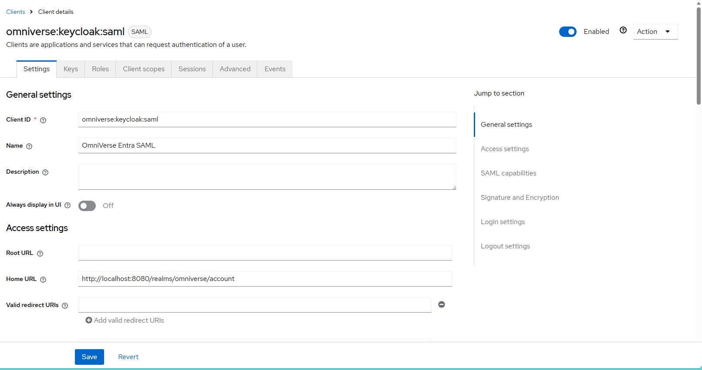

### 5. OmniVerse Keycloak Enterprise Application
Shows the Enterprise Application created in Microsoft Entra ID.
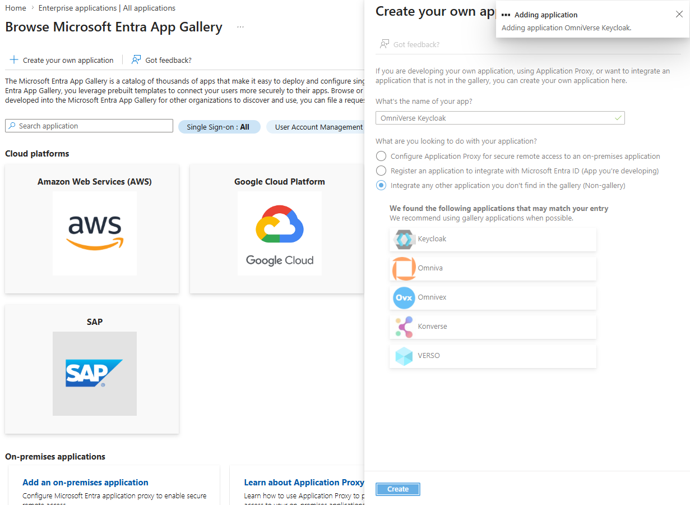

### 6. Blank SAML Configuration
Shows the initial SAML configuration state before values were added.
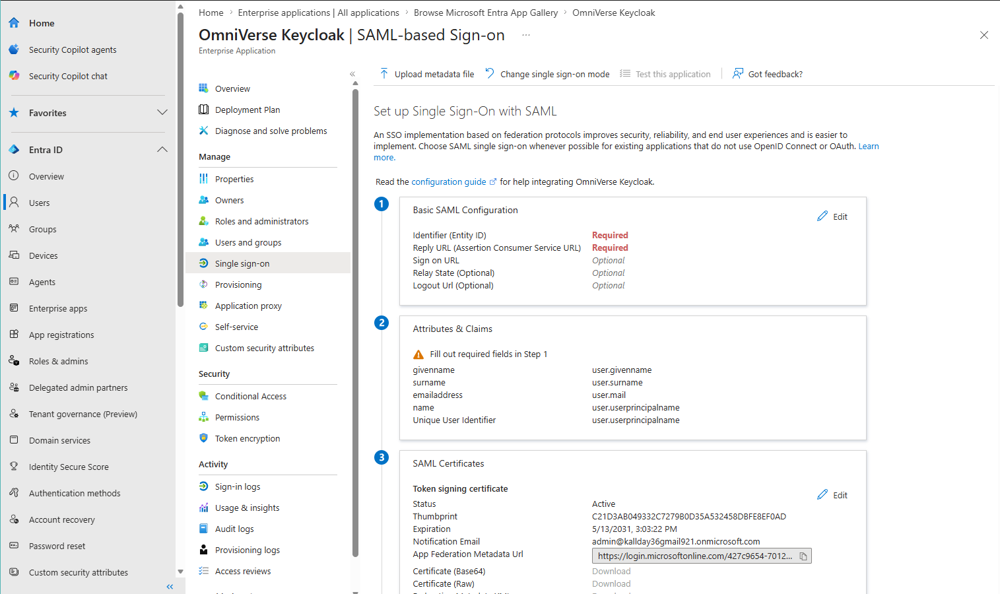

### 7. Basic SAML Configuration
Shows the completed Basic SAML Configuration in Microsoft Entra ID.
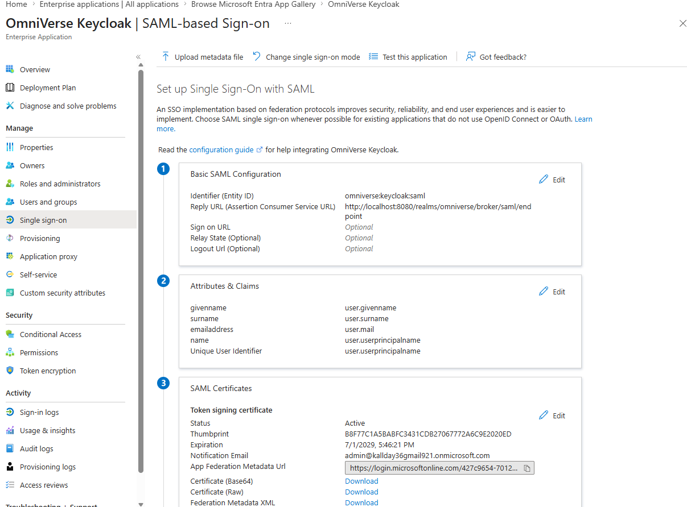

### 8. SAML Certificate
Shows the Microsoft Entra SAML signing certificate.
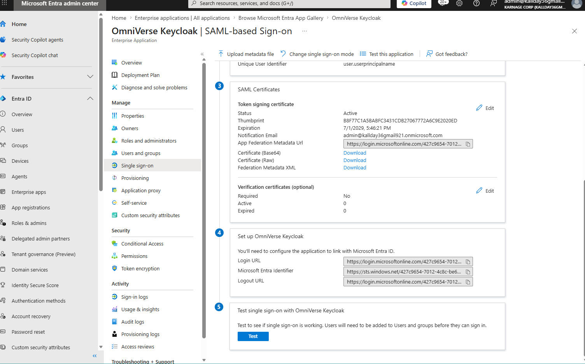

### 9. Metadata Import
Shows the Entra metadata URL imported into the Keycloak client.
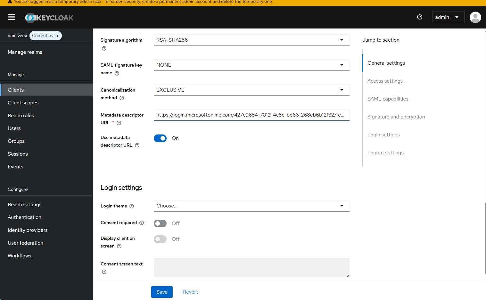

### 10. Keycloak IdP Metadata
Shows the Keycloak realm SAML metadata descriptor.
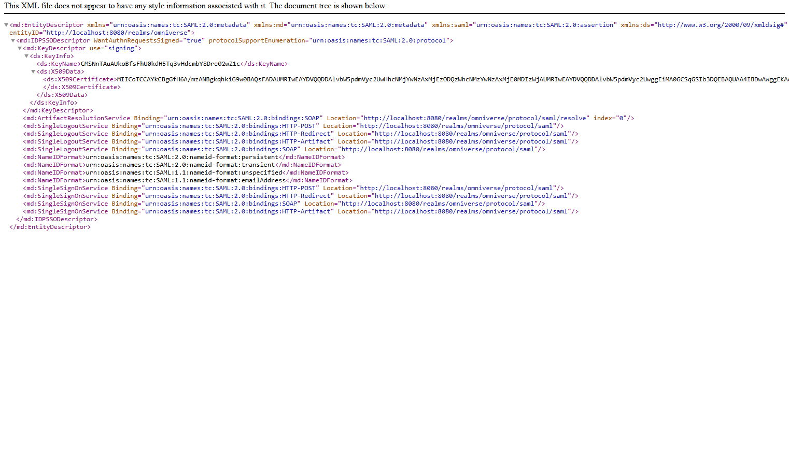

### 11. Final SAML Configuration
Shows the final Keycloak client SAML configuration.
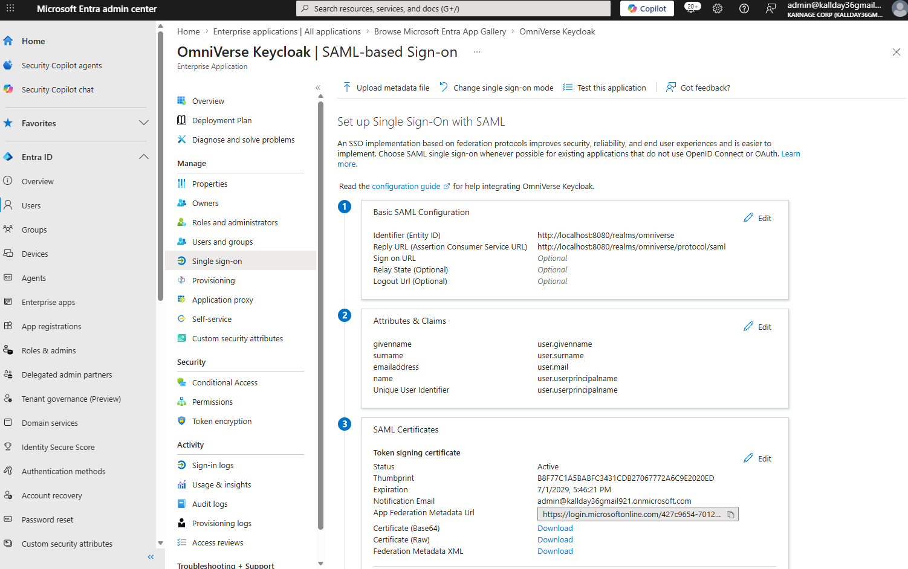

### 12. First Broker Login
Shows the Keycloak first broker login prompt after SAML authentication.
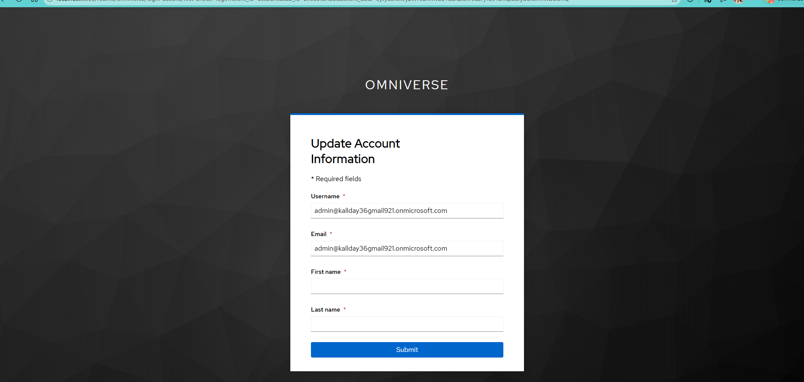

### 13. Account Information Update
Shows the profile update confirmation after the first broker login.
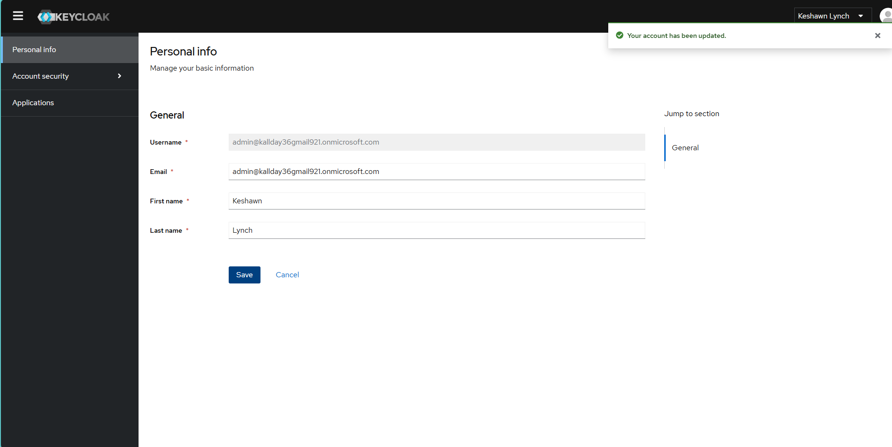

### 14. Linked Identity Provider
Shows the Keycloak Linked Accounts page confirming Microsoft Entra ID as the federated login provider.


---

## Troubleshooting

### Issue 1 - Wrong Federation Pattern
Used a direct SAML client instead of Identity Provider Brokering. Keycloak returned `Invalid Request` and `Unknown saml response` errors. Resolved by switching to the Identity Provider Brokering pattern.

### Issue 2 - Admin Password Unknown
Keycloak container admin password was unknown. Resolved by stopping and removing the container and redeploying with known credentials via environment variables.

### Issue 3 - Reply URL Mismatch (AADSTS50011)
Keycloak was sending the old SAML client ACS URL. Resolved by using the broker login URL to initiate a clean SP-initiated flow.

### Issue 4 - Entity ID Mismatch (AADSTS700016)
Entity ID in the SAML request did not match the registered application. Resolved by updating the Entra Identifier to match the Keycloak broker SP metadata.

---

## Lessons Learned

Keycloak Identity Provider Brokering is the correct pattern for federating with an upstream IdP. JIT provisioning through the first broker login flow creates users in the Keycloak realm on first login without requiring pre-provisioning.

---

## Future Enhancements

- Configure SCIM provisioning from Entra to Keycloak
- Add group-to-role mapping from Entra claims to Keycloak roles
- Configure Conditional Access policies in Entra
- Deploy Keycloak behind HTTPS with a real domain
- Connect to IAM-004 Conditional Access and Zero Trust
