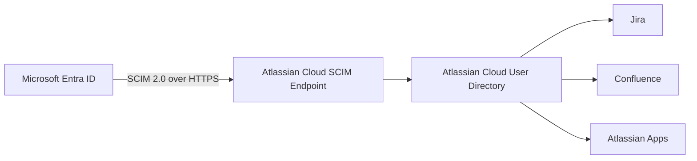

## Enterprise Application Packages

- [Repository Home](../../README.md)
- [Grafana SAML Onboarding](../Grafana/README.md)
- [WordPress OIDC Onboarding](../WordPress/README.md)
- [GitHub Enterprise SAML Onboarding](../GitHub-Enterprise/README.md)
- [Salesforce SAML Onboarding](../Salesforce/README.md)
- [Atlassian Jira SAML Onboarding](../Jira/README.md)
- [Cisco Duo Identity Integration](../Cisco-Duo/README.md)
- [Keycloak SAML Federation](../Keycloak/README.md)

---

# APP-1008 - SCIM Provisioning with Microsoft Entra ID and Atlassian Cloud

## Business Request

The Identity and Access Management team requested automated user provisioning for Atlassian Cloud to eliminate manual account management, ensure consistent attribute synchronization, and enable automatic deprovisioning when users leave the organization.

---

## Implementation Summary

| Area | Configuration |
|---|---|
| Protocol | SCIM 2.0 |
| Identity Provider | Microsoft Entra ID |
| Target Application | Atlassian Cloud |
| Provisioning Mode | Automatic |
| Scope | Assigned users and groups |
| Object Actions | Create, Update, Delete |
| Connectivity | Atlassian SCIM Base URL and API Key |
| Status | Successfully Configured |

---

## Architecture

---

## Configuration Steps

1. Opened the Atlassian Cloud Enterprise Application in Microsoft Entra ID.
2. Navigated to Provisioning and set Provisioning Mode to Automatic.
3. Retrieved the SCIM Base URL and API Key from Atlassian Administration.
4. Entered the SCIM credentials into Microsoft Entra ID Admin Credentials.
5. Tested connectivity and confirmed a successful connection.
6. Reviewed and configured attribute mappings.
7. Configured scoping filters to provision assigned users only.
8. Ran Provision on Demand to validate provisioning before full sync.
9. Resolved attribute mapping errors identified during testing.
10. Reviewed provisioning logs to confirm successful user creation.

---

## SCIM Attribute Mapping

| Microsoft Entra ID | Atlassian Cloud | Mapping Type |
|---|---|---|
| userPrincipalName | userName | Direct |
| givenName | name.givenName | Direct |
| surname | name.familyName | Direct |
| mail | emails[type eq "work"].value | Direct |
| objectId | externalId | Direct |
| Switch([IsSoftDeleted]) | active | Expression |

---

## Validation

- Provisioning Mode set to Automatic.
- SCIM connectivity validated using Test Connection.
- Attribute mappings confirmed for all required user attributes.
- Provision on Demand successfully created a test user in Atlassian Cloud.
- Provisioning logs confirmed synchronization activity.
- Scoping confirmed as assigned users only with Create, Update, Delete enabled.

---

## Screenshots

### 1. SCIM Provisioning Overview
Shows the Atlassian Cloud Enterprise Application provisioning overview in Microsoft Entra ID.

### 2. Admin Credentials Configuration
Shows the SCIM provisioning configuration page where Provisioning Mode was set to Automatic and Atlassian SCIM credentials were entered.

### 3. SCIM API Key and Provisioning Settings
Shows the Atlassian Administration page where the SCIM API key was generated.

### 4. Provisioning Email Error
Shows the provisioning error encountered when the mail attribute was not correctly mapped, used to identify and resolve the configuration gap.

### 5. Provision on Demand
Shows the Provision on Demand interface used to validate provisioning for a specific user before enabling full sync.

### 6. Scoping Filters and Assignments
Shows the scoping configuration confirming provisioning is limited to assigned users with Create, Update, and Delete lifecycle operations enabled.

### 7. Attribute Mapping
Shows the configured attribute mappings between Microsoft Entra ID and Atlassian Cloud.

### 8. Provisioning Logs
Shows the Microsoft Entra ID provisioning logs confirming synchronization activity.

---

## Troubleshooting

### Issue 1 - Missing Email Attribute Mapping
Initial provisioning failed because the mail attribute was not mapped to `emails[type eq "work"].value`, which is the SCIM-compliant format Atlassian Cloud requires. Resolved by updating the attribute mapping and rerunning Provision on Demand.

---

## Lessons Learned

SCIM provisioning requires exact attribute mapping to the target application's SCIM schema. Provision on Demand is an essential validation step before enabling full automatic provisioning. Provisioning logs should be reviewed after every configuration change.

---

## Future Enhancements

- Configure group provisioning and group-to-role mapping
- Validate deprovisioning behavior when users are removed from scope
- Extend SCIM provisioning to additional Atlassian products
- Automate provisioning lifecycle with Microsoft Graph
- Connect to IAM-004 Conditional Access and Zero Trust
