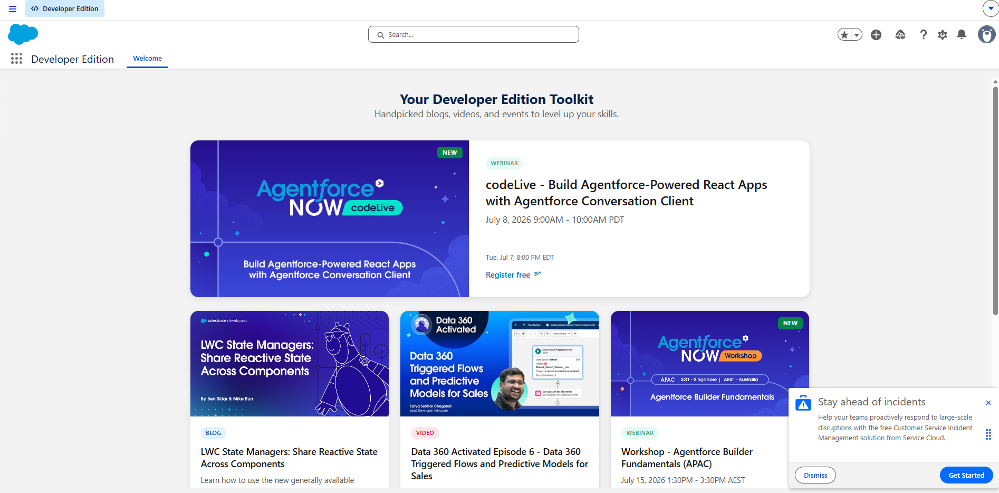
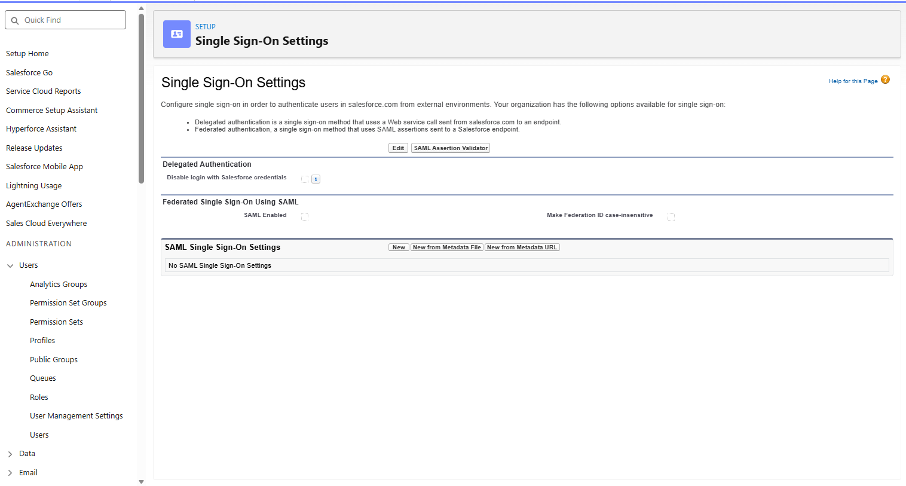
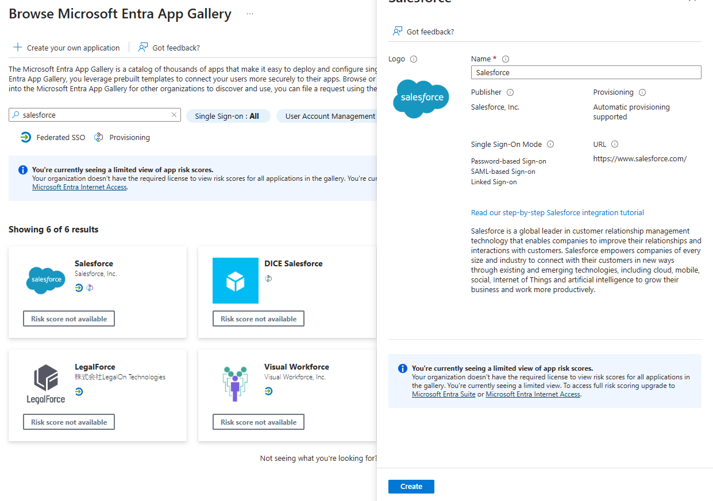
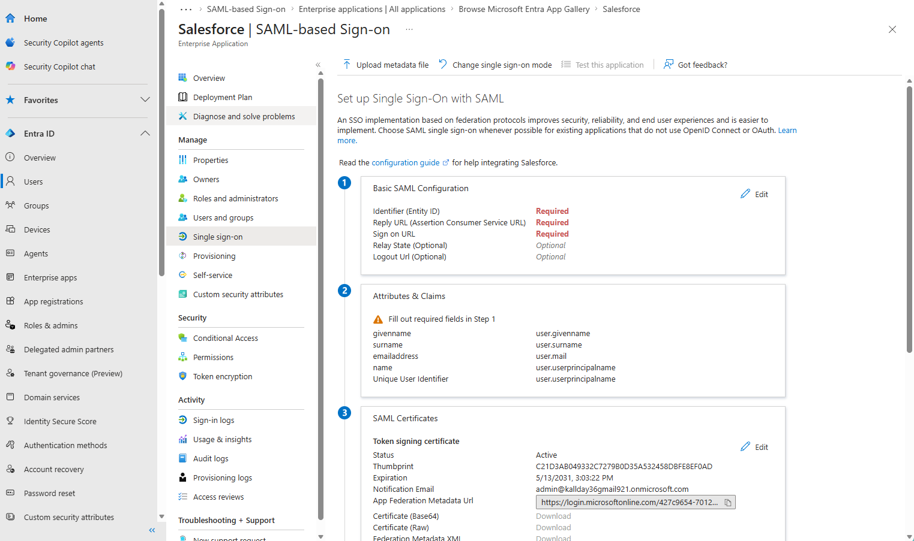
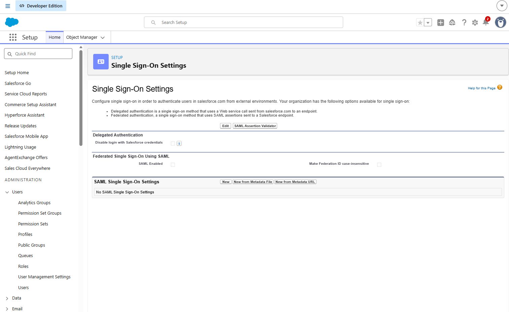
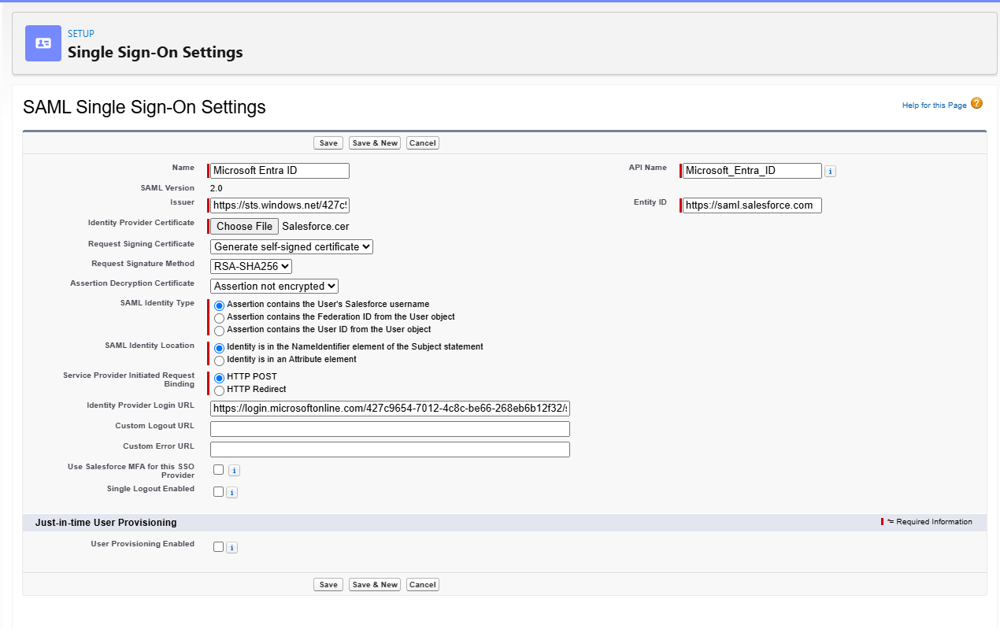
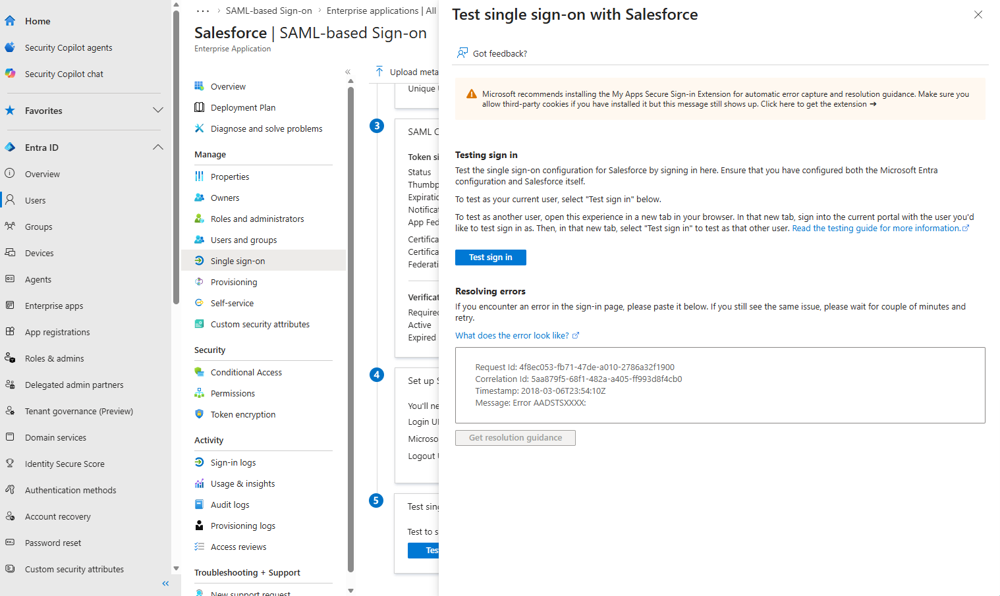

## Enterprise Application Packages

- [Repository Home](../../README.md)
- [Grafana SAML Onboarding](../Grafana/README.md)
- [WordPress OIDC Onboarding](../WordPress/README.md)
- [GitHub Enterprise SAML Onboarding](../GitHub-Enterprise/README.md)
- [ServiceNow SAML Onboarding](../ServiceNow/README.md)
- [Custom OIDC Application](../Custom-OIDC-App/README.md)
- [SCIM Provisioning](../SCIM-Provisioning/README.md)

---

# APP-1004 — Salesforce SAML Onboarding

## Overview

This application onboarding package documents the integration of Salesforce Developer Edition with Microsoft Entra ID using SAML 2.0.

The objective was to centralize authentication for Salesforce through Microsoft Entra ID, validate SAML-based Single Sign-On, and document a repeatable enterprise onboarding process for SaaS applications.

---

## Business Request

The Sales Operations team requested Single Sign-On for Salesforce to reduce local credential management, improve authentication security, and align Salesforce access with the organization's centralized identity platform.

---

## Business Requirements

- Integrate Salesforce with Microsoft Entra ID
- Authenticate users using SAML 2.0
- Use Salesforce My Domain for SSO routing
- Configure Microsoft Entra ID as the Identity Provider
- Configure Salesforce as the Service Provider
- Validate successful SSO from Microsoft Entra ID
- Document configuration, screenshots, and operational lessons learned

---

## Why SAML?

Salesforce is a mature enterprise SaaS platform that commonly supports SAML 2.0 federation with enterprise identity providers.

SAML was selected because it allows Microsoft Entra ID to authenticate users and send a signed assertion to Salesforce. Salesforce validates the assertion using the configured issuer, certificate, ACS URL, and user identifier mapping.

This mirrors a common real-world IAM onboarding process for enterprise SaaS applications.

---

## Implementation Summary

| Area | Configuration |
|---|---|
| Application | Salesforce Developer Edition |
| Protocol | SAML 2.0 |
| Identity Provider | Microsoft Entra ID |
| Service Provider | Salesforce |
| Salesforce Domain | My Domain enabled |
| Provisioning | Manual |
| Certificate | Microsoft Entra token signing certificate |
| Status | Successfully Configured and Validated |

---

## Environment Details

| Item | Value |
|---|---|
| Salesforce Org | OmniVerse |
| Salesforce Edition | Developer Edition |
| My Domain | `orgfarm-f3028ef358-dev-ed.develop.my.salesforce.com` |
| Salesforce Organization ID | `00Dfj00000T4EJp` |
| Identity Provider | Microsoft Entra ID |
| Tenant ID | `427c9654-7012-4c8c-be66-268eb6b12f32` |

---

## SAML Configuration

| Setting | Value |
|---|---|
| Identifier / Entity ID | `https://saml.salesforce.com` |
| Reply URL / ACS URL | `https://orgfarm-f3028ef358-dev-ed.develop.my.salesforce.com/?so=00Dfj00000T4EJp` |
| Sign-on URL | `https://orgfarm-f3028ef358-dev-ed.develop.my.salesforce.com` |
| Identity Provider Login URL | Microsoft Entra SAML Login URL |
| Issuer | Microsoft Entra Identifier |
| SAML Version | 2.0 |
| Request Binding | HTTP POST |

---

## Configuration Highlights

The implementation included:

- Creating a Salesforce Developer Edition environment
- Confirming Salesforce My Domain was deployed
- Creating the Salesforce Enterprise Application in Microsoft Entra ID
- Configuring Basic SAML settings in Microsoft Entra ID
- Downloading the Microsoft Entra token signing certificate
- Creating a SAML Single Sign-On configuration in Salesforce
- Uploading the Microsoft Entra certificate into Salesforce
- Mapping the SAML identity location to the NameIdentifier element
- Testing SSO from Microsoft Entra ID into Salesforce
- Validating successful Salesforce login through federated authentication

---

## Validation Results

Validation confirmed:

- Microsoft Entra ID successfully initiated SAML authentication
- Salesforce accepted the SAML assertion
- Salesforce login completed successfully through SSO
- The configured Salesforce SAML settings were saved successfully
- The user reached the Salesforce application without using standalone Salesforce credentials

---

# Screenshots

## 1. Salesforce Home

This screenshot shows the Salesforce Developer Edition environment used for the onboarding. It establishes the application baseline before SAML authentication was configured.



---

## 2. Salesforce Single Sign-On Settings

This screenshot shows the Salesforce Single Sign-On Settings page before or during SAML configuration. This is where Salesforce administrators create SAML configurations for external identity providers.



---

## 3. Salesforce Enterprise Application in Microsoft Entra Gallery

This screenshot documents the Salesforce gallery application inside Microsoft Entra ID. Using the official gallery application helps standardize the SAML integration and provides recommended configuration patterns.



---

## 4. Microsoft Entra Basic SAML Configuration

This screenshot shows the Basic SAML Configuration in Microsoft Entra ID. The Identifier, Reply URL, and Sign-on URL define how Microsoft Entra ID sends the SAML response to Salesforce.



---

## 5. Salesforce SAML Configuration

This screenshot shows the Salesforce-side SAML configuration where Microsoft Entra ID is configured as the Identity Provider. This includes the issuer, certificate, login URL, entity ID, and SAML identity settings.



---

## 6. Salesforce SAML Configuration Saved

This screenshot confirms that the SAML configuration was successfully saved inside Salesforce. This validates that Salesforce accepted the IdP metadata and SAML settings.



---

## 7. Microsoft Entra SAML Test

This screenshot documents the Microsoft Entra SAML test workflow. Testing from Entra confirms that the Enterprise Application can initiate the SAML flow toward Salesforce.



---

## 8. Successful Salesforce SSO Login

This screenshot confirms successful login to Salesforce after SAML authentication. This is the final validation that Microsoft Entra ID and Salesforce established a working federation relationship.


---

## Troubleshooting

### Issue 1 — Reply URL Format

#### Problem

Microsoft Entra ID rejected the Salesforce Reply URL when it was entered without a slash before the query string.

#### Root Cause

The initial Reply URL used this format:

```text
https://orgfarm-f3028ef358-dev-ed.develop.my.salesforce.com?so=00Dfj00000T4EJp
```

Microsoft Entra ID required a slash before the query parameter.

#### Resolution

The Reply URL was corrected to:

```text
https://orgfarm-f3028ef358-dev-ed.develop.my.salesforce.com/?so=00Dfj00000T4EJp
```

#### Result

Microsoft Entra ID accepted the Basic SAML Configuration.

---

### Issue 2 — Salesforce Organization ID Required

#### Problem

The correct ACS URL required the Salesforce Organization ID.

#### Root Cause

Salesforce uses the `so=` query parameter to identify the correct Salesforce organization during SAML authentication.

#### Resolution

The Salesforce Organization ID was retrieved from:

```text
Setup → Company Information
```

The organization ID used was:

```text
00Dfj00000T4EJp
```

#### Result

The correct Salesforce ACS URL was built and accepted by Microsoft Entra ID.

---

## Engineering Takeaways

This onboarding demonstrated a full enterprise SAML integration between Salesforce and Microsoft Entra ID.

Key engineering activities included:

- Enterprise application onboarding
- Salesforce My Domain validation
- Microsoft Entra Enterprise Application configuration
- SAML 2.0 federation
- ACS URL construction
- Entity ID configuration
- SAML certificate exchange
- Identity Provider configuration
- Service Provider configuration
- SSO testing and validation
- Troubleshooting Reply URL formatting issues

---

## Business Outcome

Salesforce was successfully integrated with Microsoft Entra ID using SAML 2.0. The implementation centralizes authentication, reduces local credential dependency, and provides a repeatable onboarding model for future SaaS integrations across OmniVerse Enterprise.

---

## Future Enhancements

- Enable group-based access assignment
- Configure Federation ID mapping for enterprise-scale user matching
- Integrate Conditional Access policies
- Document Salesforce user provisioning options
- Explore SCIM or automated lifecycle management
- Add Salesforce sign-in monitoring to Microsoft Sentinel
