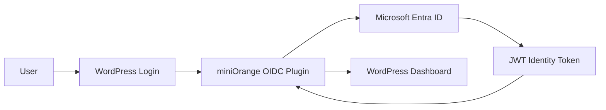

## Enterprise Application Packages

- [Repository Home](../../README.md)
- [Grafana SAML Onboarding](../Grafana/README.md)
- [GitHub Enterprise SAML Onboarding](../GitHub-Enterprise/README.md)
- [Salesforce SAML Onboarding](../Salesforce/README.md)
- [Atlassian Jira SAML Onboarding](../Jira/README.md)
- [Cisco Duo Identity Integration](../Cisco-Duo/README.md)
- [Keycloak SAML Federation](../Keycloak/README.md)
- [SCIM Provisioning](../SCIM-Provisioning/README.md)

---

# APP-1002 - WordPress OIDC Onboarding

## Business Request

The Digital Services team requested Single Sign-On for WordPress to centralize authentication through Microsoft Entra ID and eliminate local WordPress credential management.

---

## Implementation Summary

| Area | Configuration |
|---|---|
| Application | WordPress |
| Protocol | OpenID Connect (OIDC) |
| Identity Provider | Microsoft Entra ID |
| Service Provider | WordPress |
| Authentication Flow | OAuth 2.0 / OIDC |
| Plugin | miniOrange OAuth Single Sign-On |
| Provisioning | Manual |
| Status | Successfully Configured |

---

## Architecture

---

## Configuration Steps

1. Deployed a local WordPress environment using LocalWP.
2. Installed the miniOrange OAuth/OpenID Connect plugin.
3. Created a Microsoft Entra App Registration.
4. Generated a client secret.
5. Configured OIDC endpoints in WordPress.
6. Updated WordPress from HTTP to HTTPS so the callback URL matched Entra requirements.
7. Validated JWT token issuance.
8. Configured attribute mapping.
9. Validated successful access to the WordPress dashboard.

---

## Claims and Attribute Mapping

| Claim | WordPress Attribute |
|---|---|
| preferred_username | Username |
| email | Email address |
| name | Display name |
| oid | Entra object identifier |
| tid | Tenant identifier |

---

## Validation

- Microsoft Entra ID issued a valid JWT identity token.
- WordPress accepted the OIDC response.
- JWT claims returned correctly.
- Attribute mapping completed successfully.
- User reached the WordPress dashboard after authentication.

---

## Screenshots

### 1. LocalWP Site Created
Shows the local WordPress environment used for the application onboarding.

### 2. WordPress Admin Dashboard
Confirms WordPress was deployed and accessible before SSO configuration.

### 3. OIDC Plugin Search
Shows discovery of the miniOrange OAuth/OpenID Connect plugin.

### 4. miniOrange Plugin Installed
Confirms the OIDC plugin was installed and activated.

### 5. Client Secret Created
Shows the Microsoft Entra client secret creation step.

### 6. OIDC Configuration
Shows initial WordPress OIDC configuration values.

### 7. Completed OIDC Configuration
Shows completed endpoint and credential configuration.

### 8. Successful Token Validation
Shows successful JWT token validation after authentication.

### 9. Attribute Mapping
Shows claim mapping from Entra ID to WordPress attributes.

### 10. Invalid Client Secret Error
Documents the real troubleshooting issue encountered during testing.

### 11. Successful Dashboard Access
Confirms successful access to WordPress after OIDC authentication.

---

## Troubleshooting

### Issue 1 - HTTP Callback URL
The miniOrange plugin generated an HTTP callback URL. Entra requires HTTPS. Resolved by updating the WordPress Address and Site Address to HTTPS so the plugin regenerated a secure callback URL.

### Issue 2 - Invalid Client Secret (AADSTS7000215)
Authentication failed because the Secret ID was used instead of the Secret Value. Resolved by generating a new secret and configuring the correct Value.

---

## Engineering Takeaways

This onboarding demonstrated OIDC application registration, redirect URI handling, client secret management, JWT validation, attribute mapping, and real-world troubleshooting.

---

## Future Enhancements

- SCIM user provisioning
- Group-based authorization and RBAC
- Conditional Access policy integration
