## Enterprise Application Packages

- [Repository Home](../../README.md)
- [Grafana SAML Onboarding](../Grafana/README.md)
- [ServiceNow SAML Onboarding](../ServiceNow/README.md)
- [Salesforce SAML Onboarding](../Salesforce/README.md)
- [GitHub Enterprise Onboarding](../GitHub-Enterprise/README.md)
- [Custom OIDC Application](../Custom-OIDC-App/README.md)
- [SCIM Provisioning](../SCIM-Provisioning/README.md)

---
# APP-1002 — WordPress OIDC Onboarding

## Overview

This application onboarding package documents the integration of WordPress with Microsoft Entra ID using OpenID Connect (OIDC). The objective was to centralize authentication, eliminate reliance on local WordPress accounts, and demonstrate a repeatable enterprise application onboarding process using industry-standard identity protocols.

---

## Business Request

The Digital Services team requested Single Sign-On for the internal WordPress platform to improve security, reduce password management overhead, and provide a centralized authentication experience using Microsoft Entra ID.

The implementation also serves as a reference onboarding package for future OpenID Connect integrations across the organization.

---

## Business Requirements

- Integrate WordPress with Microsoft Entra ID
- Authenticate users using OpenID Connect
- Eliminate local credential management
- Centralize identity management
- Validate secure token-based authentication
- Document a repeatable onboarding process
- Capture implementation and troubleshooting steps

---

## Implementation Summary

| Area | Configuration |
|---|---|
| Application | WordPress |
| Protocol | OpenID Connect |
| Identity Provider | Microsoft Entra ID |
| Service Provider | WordPress |
| Authentication | OAuth 2.0 / OIDC |
| Plugin | miniOrange OAuth Single Sign-On |
| Provisioning | Manual |
| Access Model | Entra ID Authentication |
| Status | Successfully Configured |

---

## Configuration Highlights

The implementation included:

- Deployment of a local WordPress environment using LocalWP
- Installation of the miniOrange OAuth/OpenID Connect plugin
- Creation of a Microsoft Entra ID App Registration
- Generation of a secure Client Secret
- Configuration of OAuth 2.0 / OIDC endpoints
- Establishment of trust between WordPress and Microsoft Entra ID
- JWT token validation
- User attribute mapping
- End-to-end authentication testing

---

## Validation Results

Validation confirmed that:

- Microsoft Entra ID successfully authenticated users
- JWT identity tokens were successfully issued
- User claims were returned correctly
- WordPress accepted the identity token
- User attributes were mapped successfully
- Single Sign-On completed successfully without local WordPress credentials

---

## Troubleshooting

### Issue 1 — HTTP Callback URL

#### Problem

During the initial OpenID Connect configuration, the miniOrange plugin automatically generated the Callback URL using HTTP.

```text
http://omniverse-identity.local
```

Microsoft Entra ID requires secure HTTPS redirect URIs for enterprise web applications.

#### Root Cause

Although LocalWP had SSL enabled, the WordPress Address URL and Site Address URL were still configured to use HTTP. The plugin generated its callback URL from the site's configured URL.

#### Resolution

- Verified LocalWP SSL certificate was trusted.
- Updated the WordPress Address URL to HTTPS.
- Updated the Site Address URL to HTTPS.
- Reloaded the WordPress application.
- Confirmed the plugin generated an HTTPS callback URL.
- Updated the Microsoft Entra ID Redirect URI to match.

#### Result

Authentication proceeded successfully using a secure HTTPS callback URL.

---

### Issue 2 — Invalid Client Secret

#### Problem

Authentication failed with the following Microsoft Entra ID error:

```text
AADSTS7000215 — Invalid client secret provided.
```

#### Root Cause

The Client Secret ID was mistakenly used instead of the Client Secret Value generated within Microsoft Entra ID.

#### Resolution

- Generated a new Client Secret.
- Copied the Client Secret Value immediately after creation.
- Updated the WordPress OAuth configuration.
- Retested authentication.

#### Result

Microsoft Entra ID successfully authenticated the application and issued a valid JWT token.

---

## Screenshots

### 1. LocalWP Site Created

Demonstrates deployment of a local WordPress environment used to simulate an enterprise application before integrating Microsoft Entra ID.

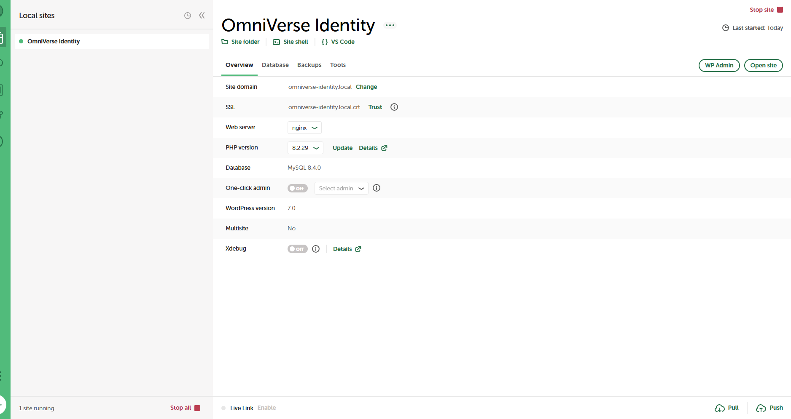

---

### 2. WordPress Administrator Dashboard

Confirms successful installation of WordPress and administrative access prior to implementing Single Sign-On.

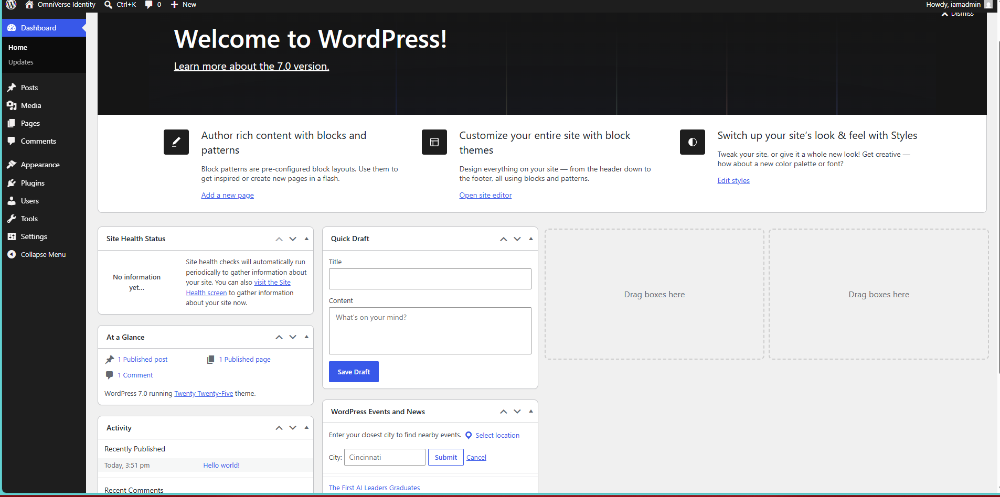

---

### 3. OAuth/OpenID Connect Plugin Search

Shows identification of the miniOrange OAuth/OpenID Connect client plugin used for enterprise authentication.

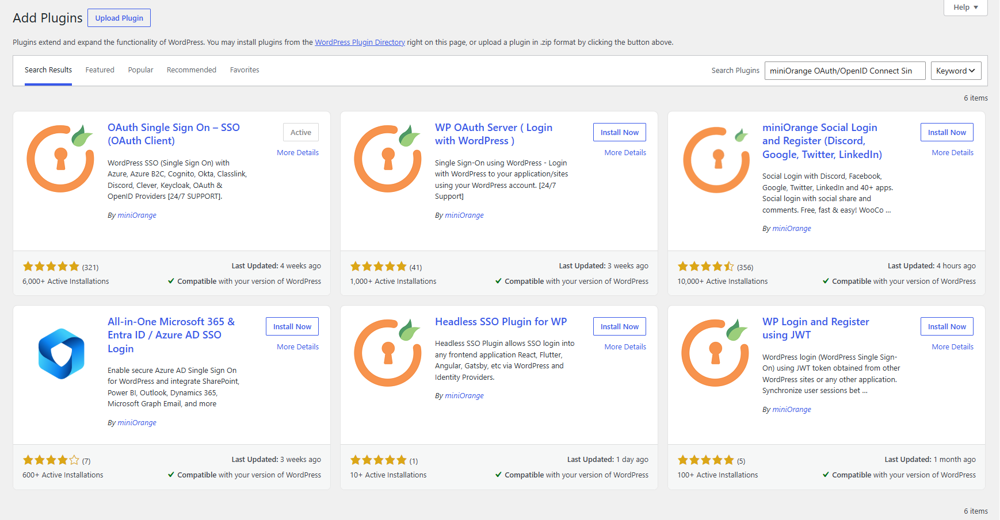

---

### 4. miniOrange Plugin Installed

Confirms installation and activation of the OAuth/OpenID Connect client responsible for communication with Microsoft Entra ID.

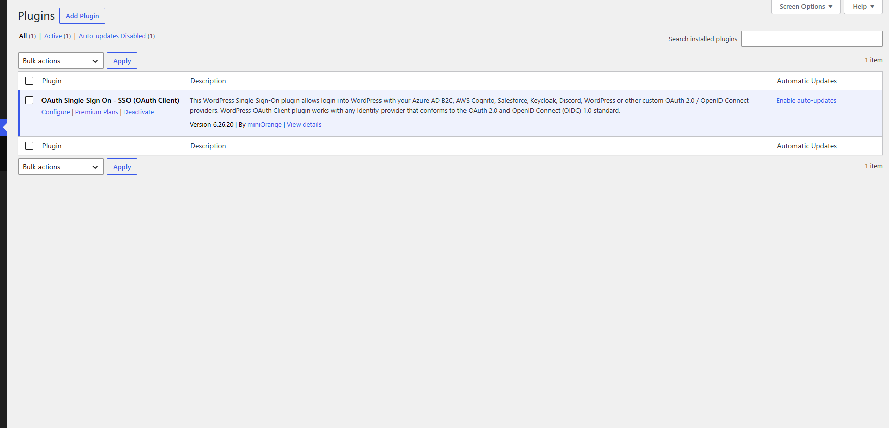

---

### 5. Client Secret Created

Documents creation of a Microsoft Entra ID Client Secret used by WordPress during OAuth authentication.

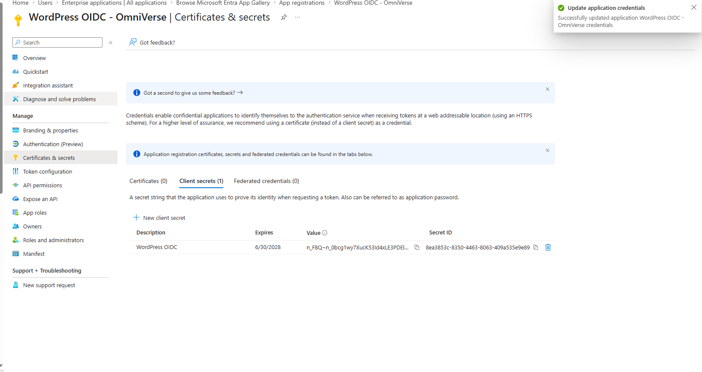

---

### 6. Initial OIDC Configuration

Shows initial configuration of the OpenID Connect provider including Client ID, Client Secret, Callback URL, Authorization Endpoint, Token Endpoint, and Scopes.

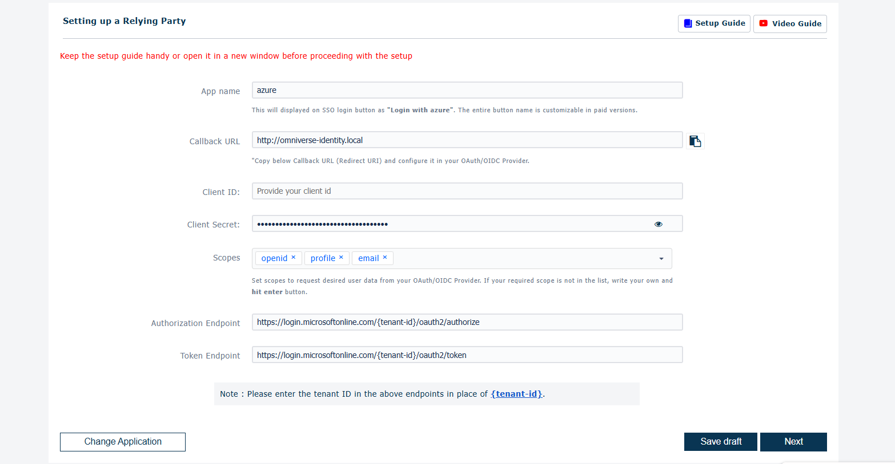

---

### 7. Completed OIDC Configuration

Demonstrates successful completion of all required OpenID Connect configuration settings.

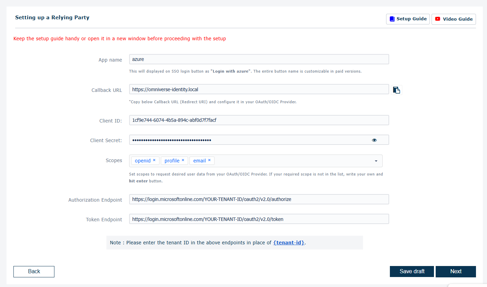

---

### 8. Successful Token Validation

Shows Microsoft Entra ID successfully issuing a JWT identity token containing authenticated user claims. This confirms the trust relationship between WordPress and Microsoft Entra ID was successfully established.

Verified claims included:

- Preferred Username
- Object ID
- Tenant ID
- Audience
- Issuer
- Subject Identifier
- Token Version

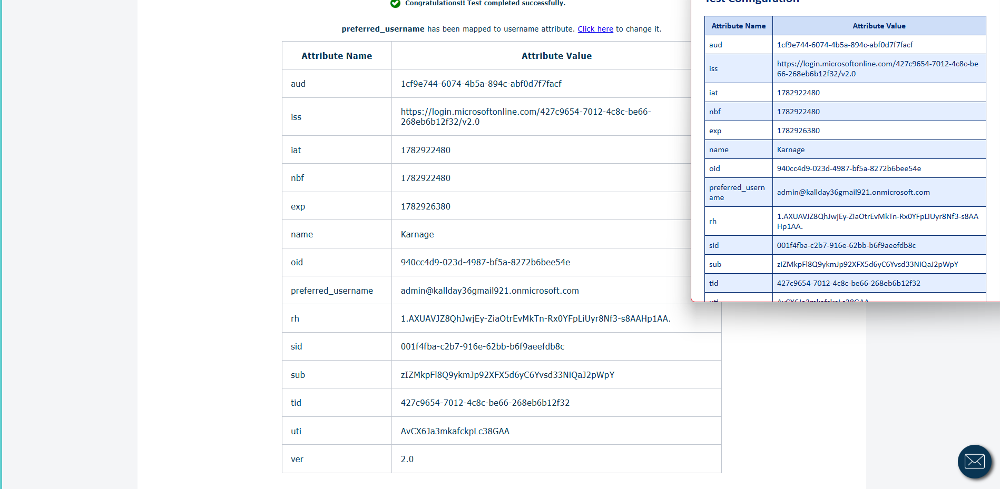

---

### 9. Attribute Mapping

Illustrates mapping Microsoft Entra ID claims to WordPress username, email address, and display name. Proper claim mapping ensures accurate identity representation following authentication.

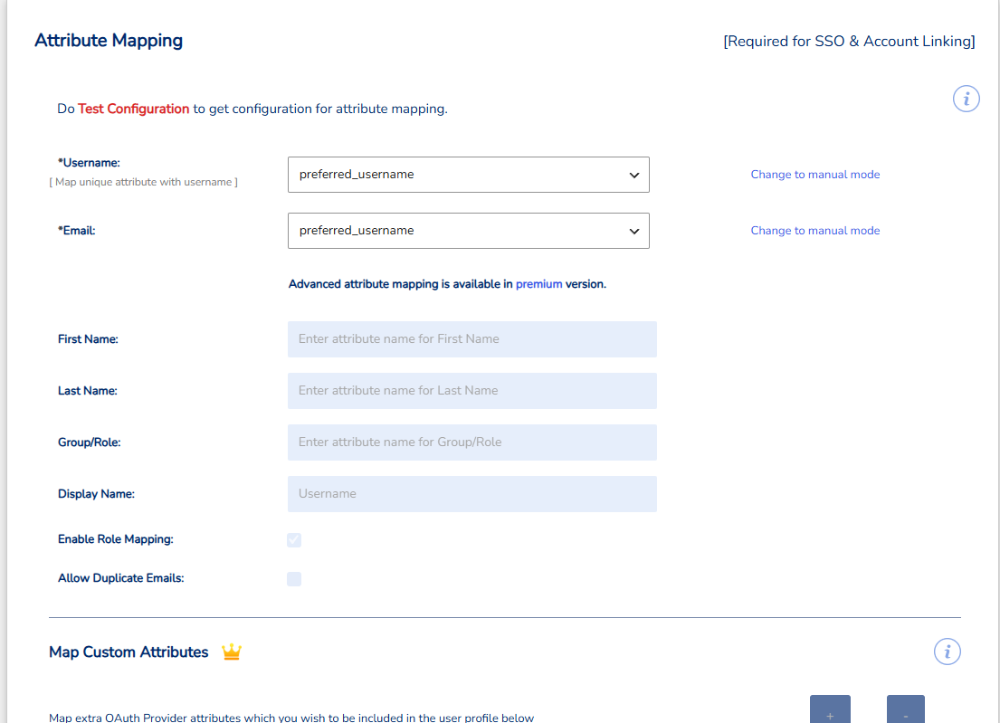

---

### 10. Authentication Troubleshooting

Captures the Invalid Client Secret error encountered during testing. Troubleshooting authentication failures is a common part of enterprise application onboarding and demonstrates the importance of validating credentials, application registrations, and OAuth configuration.

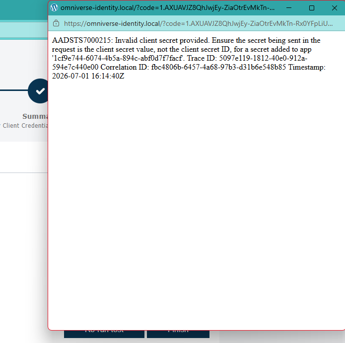

---

### 11. Successful WordPress Dashboard Login

Confirms successful authentication into WordPress using Microsoft Entra ID through OpenID Connect without requiring local WordPress credentials.

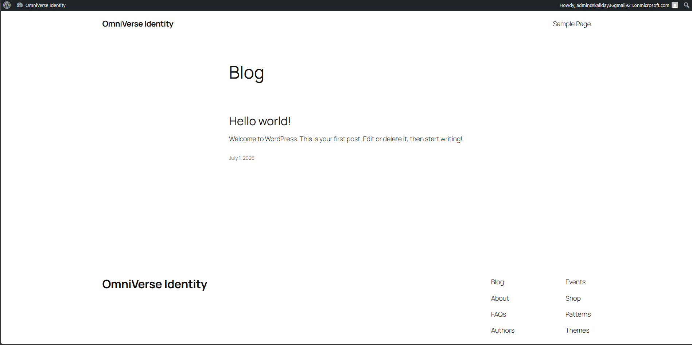

---

## Engineering Takeaways

This onboarding demonstrated the complete lifecycle of integrating an enterprise application with Microsoft Entra ID using OpenID Connect.

Engineering activities included:

- Enterprise Application Onboarding
- OAuth 2.0 / OpenID Connect
- Microsoft Entra ID App Registration
- Client Credential Management
- JWT Validation
- Attribute Mapping
- Authentication Troubleshooting
- Single Sign-On Validation
- Enterprise Documentation

The completed implementation provides a repeatable onboarding process that can be reused for future OpenID Connect integrations across enterprise applications.

---

## Future Enhancements

- Enable automatic user provisioning using SCIM
- Implement group-based authorization
- Configure role-based access control
- Enable Just-In-Time user provisioning
- Integrate Conditional Access policies
- Automate application onboarding using Microsoft Graph
- Expand monitoring using Microsoft Entra Sign-in Logs and Microsoft Sentinel

